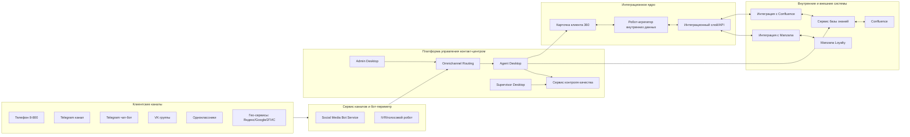

# Проект реализации омниканального контакт-центра для компании «Дикси»
### Концепция решения и архитектура

---

## Цели проекта
- Объединить все клиентские обращения в едином окне оператора.
- Сократить время обработки обращений и повысить FCR (решение с первого контакта).
- Обеспечить персонализацию: заказы, история обращений, баллы лояльности.
- Повысить качество сервиса за счет базы знаний, подсказок и контроля качества.

---

## Крупноблочная архитектурная схема решения

---

## Архитектурная схема из исходного вложения

---

## Блок 1. Клиентские каналы
**Состав:**
- Телефон 8-800.
- Telegram канал.
- Telegram чат-бот.
- Сообщества в VK и Одноклассниках.
- Гео-сервисы: Яндекс Карты, Google Maps, 2ГИС.

**Функциональность:**
- Прием обращений из всех цифровых и голосовых каналов.
- Нормализация формата сообщений/событий.
- Передача обращений в единый контур маршрутизации.
- Сохранение контекста обращения и метаданных канала.

---

## Блок 2. Платформа управления контакт-центром
**Назначение:** единая рабочая среда операторов, супервизоров и администраторов.

**Функциональность:**
- Регистрация 100% обращений из всех каналов.
- Омниканальная маршрутизация по очередям, навыкам и приоритетам.
- Agent Desktop: единое окно оператора.
- Подъем карточки клиента с историей заказов, предыдущих обращений и статусом лояльности.
- Встроенные подсказки оператору по материалам внутренней базы знаний.
- Supervisor Desktop: мониторинг SLA/KPI, контроль нагрузки и эскалации.
- Admin Desktop: настройка маршрутов, прав, очередей и бизнес-правил.

---

## Блок 3. Интеграционный слой с Базой знаний Confluence
**Назначение:** обеспечить операторов актуальными знаниями в момент обработки обращения.

**Функциональность:**
- Интеграция с Confluence через API.
- Индексация и обновление статей в сервисе базы знаний.
- Контекстный поиск по статье/разделу/теме.
- Выдача подсказок оператору в карточке обращения.
- Поддержка версий, тегов, ролей доступа.

---

## Блок 4. Интеграционный сервис с системой лояльности Manzana
**Назначение:** получение и использование данных лояльности в операционной работе КЦ.

**Функциональность:**
- Запрос баланса баллов и статуса участника.
- Получение истории начислений/списаний.
- Проверка активных персональных предложений.
- Передача результатов в карточку клиента 360.
- Логирование запросов и контроль отказоустойчивости интеграции.

---

## Блок 5. Робот-агрегатор внутренних систем
**Назначение:** единый механизм сборки данных клиента из разнородных источников.

**Функциональность:**
- Оркестрация запросов к внутренним системам.
- Объединение данных в единый профиль (заказы, обращения, лояльность).
- Очистка/дедупликация и контроль качества данных.
- Кэширование часто запрашиваемых данных.
- Передача агрегированной информации в платформу управления КЦ.

---

## Блок 6. Сервис контроля качества (супервизоры)
**Назначение:** контроль качества клиентского сервиса и соблюдения стандартов.

**Функциональность:**
- Прослушивание/просмотр диалогов по всем каналам.
- Оценочные формы и чек-листы качества.
- Контроль SLA, AHT, FCR, CSAT/NPS.
- Выявление системных ошибок и формирование корректирующих действий.
- Обратная связь операторам и контроль выполнения рекомендаций.

---

## Сквозной процесс обработки обращения
1. Клиент обращается через любой канал (телефон/мессенджер/соцсеть/гео-сервис).
2. Канальный слой и бот-сервисы нормализуют обращение.
3. Платформа КЦ регистрирует обращение и маршрутизирует его оператору.
4. Робот-агрегатор собирает данные из внутренних систем через интеграционный слой.
5. Оператор получает карточку 360 и подсказки из базы знаний.
6. В ходе диалога при необходимости подтягиваются данные лояльности Manzana.
7. Результат фиксируется, обращение закрывается, данные передаются в QA и аналитику.

---

## Ожидаемые эффекты для бизнеса
- Единая точка управления клиентскими коммуникациями.
- Рост скорости и качества ответов.
- Повышение удовлетворенности клиентов.
- Снижение операционных затрат за счет автоматизации и подсказок.
- Прозрачный контроль качества и управляемость KPI контакт-центра.

---

## План внедрения (крупные этапы)
1. Проектирование целевой архитектуры и интеграционных контрактов.
2. Подключение каналов и настройка омниканальной маршрутизации.
3. Интеграции с Confluence и Manzana, запуск робота-агрегатора.
4. Пилот на ограниченной группе операторов.
5. Полный запуск, стабилизация, настройка KPI и QA-процессов.

---

## Оценка годового бюджета реализации
**Базовые статьи затрат (в год):**
- Платформа телефонии + модуль оценки качества КЦ: **6 млн руб**.
- Робот-обработчик и нормализация обращений: **25 млн руб**.
- Аутсорсинговый контакт-центр на 50 операторов: **расчет ниже**.

**Расчет аутсорсингового КЦ (50 операторов):**
- Принята средняя ставка аутсорсинга: **130 000 руб / оператор / месяц**.
- Формула: `50 операторов × 130 000 × 12 месяцев`.
- Итого: **78 млн руб в год**.

**Итоговый ориентировочный бюджет решения:**
- `6 + 25 + 78 = 109 млн руб в год`.

**Диапазон чувствительности (по ставке 120–150 тыс./оператор/мес.):**
- Нижняя граница: `50 × 120 000 × 12 = 72 млн руб/год`.
- Верхняя граница: `50 × 150 000 × 12 = 90 млн руб/год`.
